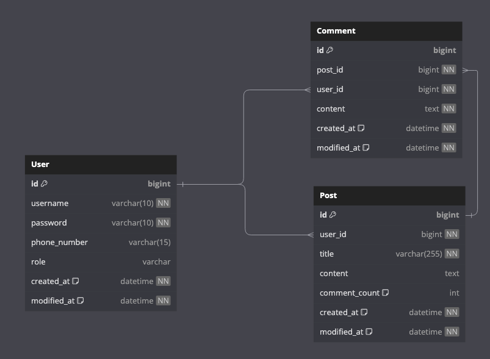

## 커뮤니티 사이트 만들기
유저들간의 의견을 공유하며 소통할 수 있는 간단한 커뮤니티 사이트 프로젝트입니다.

## 프로젝트 기능 및 설계
- 회원 가입 기능
  - [ ] 일반적으로 사용자는 회원 가입시 USER(일반 권한)지닌다.
  - [ ] 회원가입 시 사용자가 사용할 아이디, 비밀번호, 핸드폰 번호를 입력받아야 한다.
  - [ ] 입력받은 아이디는 중복되지 않아야 하며 중복 시 적절한 에러 응답을 반환한다. 
      - 아이디는 최대 10자, 비밀번호 최대 10자 핸드폰 번호는 15자를 넘기면 안된다.

- 로그인 기능
  - [ ] 로그인 성공 시 JWT 토큰이 발급된다.
  - [ ] 잘못된 아이디 또는 비밀번호로 로그인시 적절한 에러 응답을 반환한다. 

- 게시글 작성 기능
    - [ ] 로그인한 사용자는 권한에 관계없이 게시글을 작성할 수 있다.
    - [ ] 사용자는 게시글 작성 시 제목과 내용을 입력해야 한다.
    - [ ] 게시글 작성 성공 시 생성된 게시글의 ID와 관련 정보(제목, 작성자 ID)가 반환되게 한다.

- 게시글 목록 조회 기능
  - [ ] 로그인 하지 않는 사용자를 포함한 모든 사용자가 게시글을 조회할 수 있다.
  - [ ] 게시글은 최신순으로 정렬된다.
  - [ ] 댓글 수 기준으로 정렬하는 옵션을 제공한다 - (댓글이 많은 순서 or 댓글이 적은 순서)
  - [ ] 게시글 목록 조회 시 응답에 게시를 제목 - 게시글 작성일 - 댓글 수가 포함된다.
  - [ ] 게시글 목록 조회 시 페이지네이션 처리를 한다 - (최대 10개)
  
- 특정 게시글 조회 기능
  - [ ] 로그인 하지 않은 사용자를 포함한 모든 사용자가 특정 게시글을 조회할 수 있다. - 게시글 조회 시(제목, 내용, 작성자, 작성일) 이 반환되도록 한다.
  - [ ] 조회할 게시글이 존재하지 않을 경우 적절한 에러 응답을 반환한다.

- 댓글 작성 기능
  - [ ] 로그인한 사용자는 권한에 관계없이 댓글을 작성할 수 있다.
  - [ ] 사용자는 댓글 작성 시 내용을 입력한다.
  - [ ] 댓글은 특정 게시글에 속해야 하며, 게시글 ID를 참조한다.
  - [ ] 댓글 작성 성공 시, 생성된 댓글의 ID와 관련정보가 반환된다.
  
## ERD

